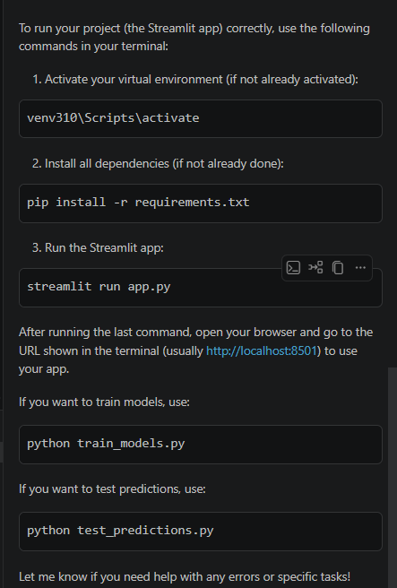

To run your project manually, follow these steps:

Activate your virtual environment:

``` venv310\Scripts\activate ```

Install dependencies (if not already installed):

``` pip install -r requirements.txt ```

Run the main application:

```run this project
 ```

If you want to train models, run:

```python train_models.py ```

To test predictions, run:

python test_predictions.py

